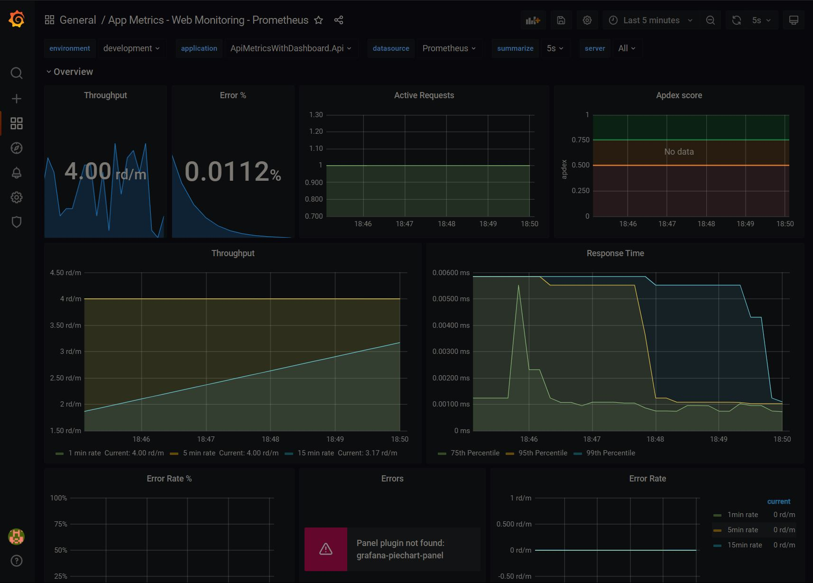

# Api metrics with Dashboard

## Description
Sample for creating dashboards from API metrics using Prometheus,Grafana and AppMetrics.

## Packages

`install-package App.Metrics.AspNetCore -v 4.0.0`  
`install-package App.Metrics.AspNetCore.Endpoints -v 4.0.0`  
`install-package App.Metrics.AspNetCore.Tracking -v 4.0.0`  
`install-package App.Metrics.Formatters.Prometheus -v 4.0.0`  

## Tools

### Prometheus

#### Download

https://github.com/prometheus/prometheus/releases/download/v2.30.3/prometheus-2.30.3.windows-amd64.zip

#### Instructions

Copy the /config/prometheus.yml
to your prometheus installation/binary folder.  
If you want to create your own or start fresh, just add at the end of the config:  
```
 - job_name: ApiMetricsWithDashboard
    static_configs:  
      - targets: ["localhost:3210"]
	metrics_path: /metrics-text
```

After you have altered the config start Prometheus.

### Grafana

#### Download

https://dl.grafana.com/oss/release/grafana-8.2.1.windows-amd64.zip

#### Instructions

Start Grafana.
Login on site localhost:3000 with admin, admin.  
Add Datasource Prometheus (http://localhost:9090/) as
datasource.  
Add new dashboard or import some predefined (for example 2204).
Have fun!

## Sample picture



